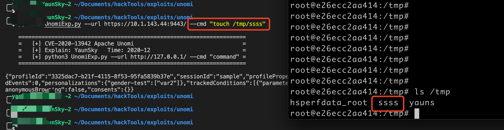
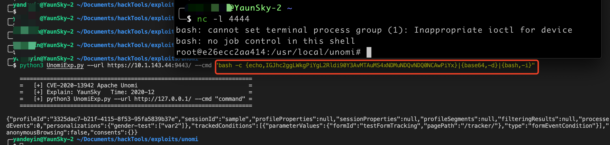

## CVE-2020-13942 Apache Unomi 远程代码执行漏洞脚本

### 漏洞简介

Apache Unomi是一个Java开源数据平台，这是一个Java服务器，旨在管理客户，潜在顾客和访问者的数据，并帮助个性化客户体验。Unomi可用于在非常不同的系统（例如CMS，CRM，问题跟踪器，本机移动应用程序等）中集成个性化和配置文件管理。

在Apache Unomi 1.5.1版本之前，攻击者可以通过精心构造的MVEL或ONGl表达式来发送恶意请求，使得Unomi服务器执行任意代码执行。

该漏洞编号为 CVE-2020-13942 ，漏洞等级：高危 ，漏洞评分：7.2

### 影响版本

Apache Unomi < 1.5.2

### 脚本编写使用环境

https://github.com/vulhub/vulhub/tree/master/unomi/CVE-2020-13942

### 脚本功能

1. **远程执行系统命令**

   

2. **反弹shell**

注意：反弹shell时，命令需要进行编码。编码地址：http://www.jackson-t.ca/runtime-exec-payloads.html

### 脚本使用方法

1. 执行系统命令

   python3 UnomiExp.py --url http://127.0.0.1/ --cmd "command" 	命令使用双引号引住

   

2. 反弹shell

   攻击机nc 监听端口，通过脚本执行命令进行反弹

   

   

